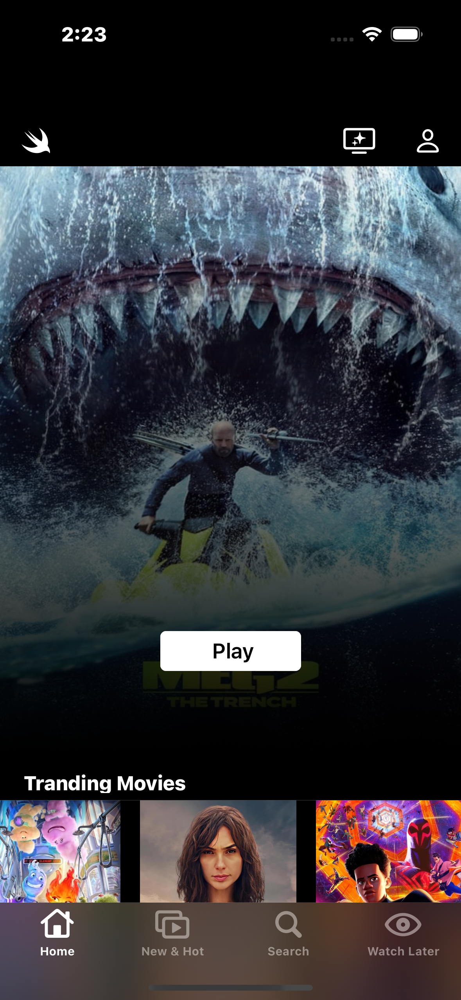
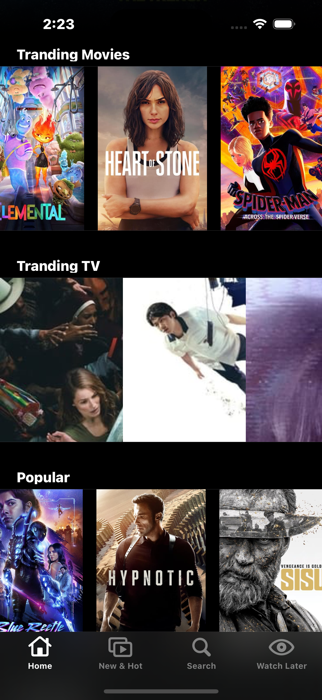
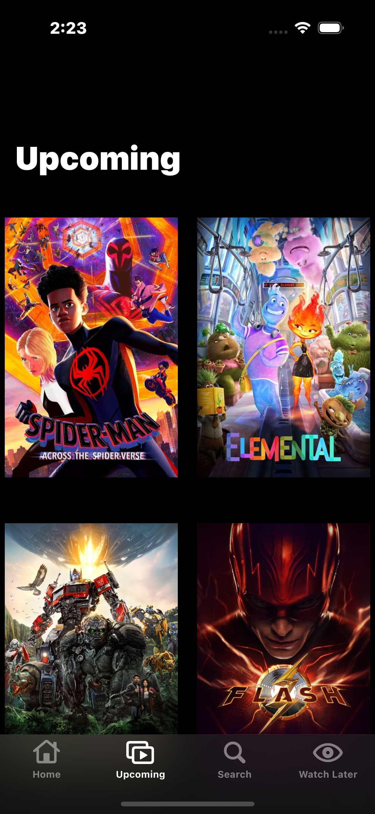
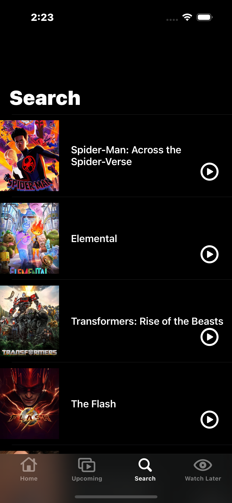
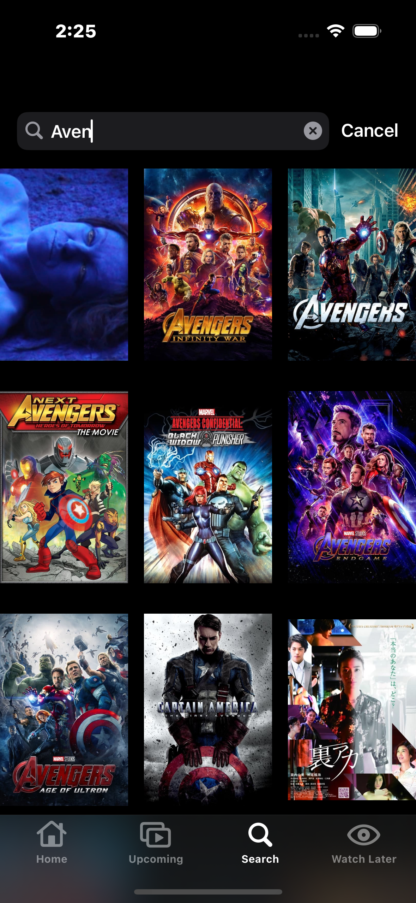
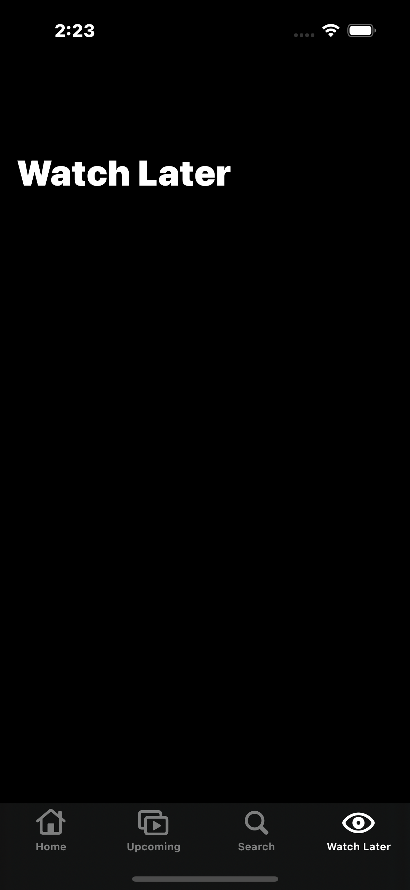

** Developed a Netflix clone iOS application using Swift**

- Implemented the MVVM design pattern. 
- Used the CoreData framework as local caching and performed offline functionality. [working](#working) 
- Used the Netflix and YouTube APIs to fetch data. 
- Used UICollectionView and UITableView to create a user-friendly interface. 
- Used the auto layout technique to enhance the user experience. 

- Home view 1 

- Home view 2

- Upcoming view 

- Search view 1

- Search view 2

- Watch Later

